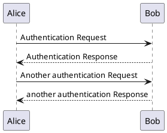

#### 数据的分类缓存

先定下：  
数据库[0] 存成员登录信息  
数据库[1] 保存当前在线且已经在被招待中的客户信息(hash) key: fingerprint, value: 客户信息
数据库[1] 存客户连接信息 用于区分什么连接是管理员的，什么是客户的，什么是客服的连接   
数据库[2] 存聊天记录  
数据库[3] 存各种消息处理队列   
  > * &nbsp;客户等待队列 (waiting_guest_queue) (存client_id, 指向数据库1)   
  > * &nbsp;客户错过队列 (guest_be_missing) (存client_id, 指向数据库1) 当客户连接时没人在客服工作台工作中就放入这里。
  > * &nbsp;客户座席队列(chat_waiting_group)  
  > * &nbsp;客户当前正在聊天的用户(hash) 记录用户的座席和用户,离开后把坐席入队    
  > * &nbsp;当前在客服线集合 chat_servers_online (uid 集合)   
  > * ~~&nbsp;保存客户设备指纹(hash) key: guest_fingerprints column: $finger_prints  value: uid~~ 
  > * &nbsp;存客服连接指针 chat_connect (hash) key:client_id value: db1_key ，指向uid, （存member_token）用于区分什么连接是管理员的，什么是客户的，什么是客服的连接   
  > * &nbsp;存客客户连接指针 `guest_connect`(hash) key:client_id value: (设备指纹指向数据库1), 用于，当一个用户连接时，判断这个用户是新客户还是老客户，如果是老客户，一定有
  缓存资料和用于找回上次聊天的uid是谁(如果是老客户就在数据库中有缓存最后一个招待的客服的uid),并在上次接待客服uid空闲的前提下，优先分配 聊天记录找回 
  > * &nbsp;**admins_connect**存管理员连接指针（存member_token）用于区分什么连接是管理员的，什么是客户的，什么是客服的连接   

### 消息订阅
>为了不其它费时的处理且将次要的业务，占用客户连接主进程,影响用户的响应时间，这类型的处理业务将
异步推送给其它专门的监听进程来处理，缩小用户的响应时间。 
>同收发消息的格式工一致。如:

#### 1  客户到连接层时需要更新一些数据就向监听进程推送消息。格式如下
``` PHP
'{
    "from"  : "/service/connect/guest/7f0000010b5700000002",       //由连接层发出要数据持久化更新的推送
    "to"    : "/service/listening/db/guest",                       //由于监听进程的db方法来持久化到guest表中 
    "time"  : 毫秒时间戳,
    "method": "PUT",                                               //是更新
    "data"  : [],
    "OR"    : "POST"                                               // 选项参数 如果更新失败就新增
    "key"   : "fingerprint"                                        // 选项参数 标注guest表的查找索引是fingerpring参数 
}'
```

### Section X

