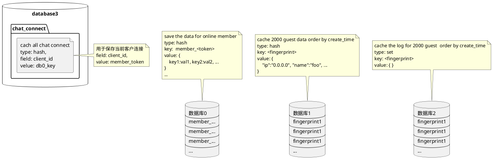

# 数据的缓存
> 为了提供给用极致的体验，数据的缓存能避免磁盘的`IO`瓶颈,当下内存缓存是不二的选择。
虽然`redis`带来了数据的高速调用，却不能提供`mysql`那种多索引的灵活，
所以为了完成的业务上的检索数据，不得不把缓存结构多样化设计来满足数据检索的需求
。
  缓存数据结构是为本应用的即时业务提供即时的数据而设计的，避免磁盘的`IO`带来了毫
  秒级响应。

## redis数据库布局图

