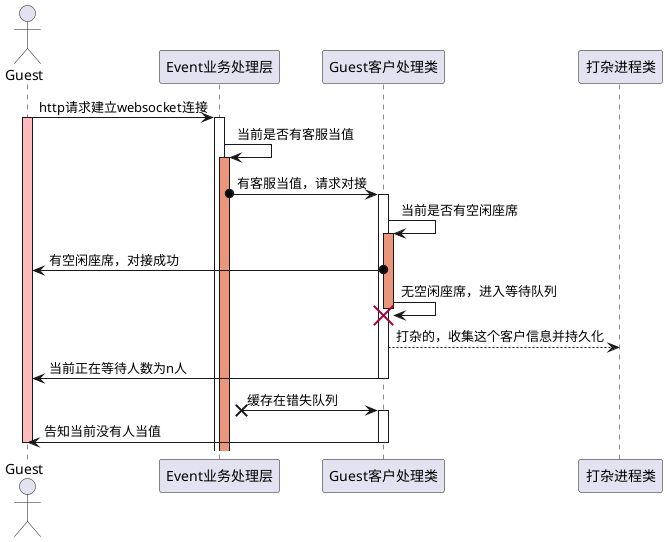

# 整体架构

> 本应用是采用`thinkphp 6` + `workerman-gateway` 这2个框架的组合来开发的，`thinkphp`
负责处理`http`的请求，而`workerman-gateway` 负责处理`websocket`的长连接处理。

## 大致划分
``` BASH
数据库
   # 用于权限验证功能
       think_auth_group           权限用户组表
       think_auth_group_access    权限分组表
       think_auth_rule            规则表
       think_member               用户表
   # 用户系统配置 
       think_config               系统配置表
   # 用于成员分组功能
       think_member_group         成员用户分组表
       think_member_group_access  用户成员分组表
       (以及上面的用户表)

数据缓存 (用于提高数据查询性能)
     member_ 开头键名 用户缓存用户信息

服务器
   http 服务端 (基于 thinkphp 6.0)
     api 模块
   websocket 服务端 (基于 workerman-gateway )

UI
  管理控制台 （layuiadmin）
  客户工作台  （layuiadmin）
```
## 目录结构

```BASH
├── app
│   ├── api                     http api 应用
│   ├── build.php
│   ├── chat                    websocket 应用
│   ├── common.php
│   ├── event.php
│   ├── ExceptionHandle.php
│   ├── index
│   ├── lib
│   ├── middleware.php
│   ├── provider.php
│   └── Request.php
├── composer.json
├── composer.lock
├── config
│   ├── api
│   ├── app.php
│   ├── cache.php
│   ├── console.php
│   ├── cookie.php
│   ├── database.php        数据库配置文件
│   ├── filesystem.php
│   ├── lang.php
│   ├── log.php
│   ├── route.php
│   ├── session.php
│   ├── template.php
│   └── trace.php
├── extend
├── public
│   ├── admin                管理员控制台前端应用
│   ├── chat                 客户工作台前端应用
│   ├── favicon.ico
│   ├── index.php
│   ├── json
│   ├── robots.txt
│   ├── router.php
│   ├── static
│   └── test.html
├── route
│   ├── api                  api 应用路由配置文件
│   ├── index
│   └── route.php
├── runtime
│   ├── api
│   ├── index
│   ├── services.php
│   └── session
├── start.php               websocket 服务器启动文件
├── tags
├── think
└── vendor
```

## 客户连接UML图示

