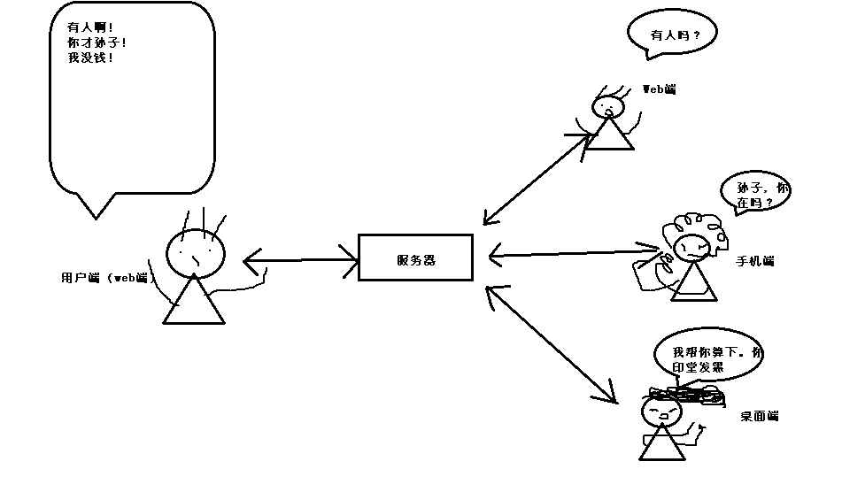

### 消息通信数据格式
>  &nbsp;由于`websocket`是双工协议，使前后端的能实时传递消息。而`sharewoker`共享子线程能
使多个页面之前实时传递消息。那么整合2个技术，可以产生更多消息传递场景，如前端
可以给后台发消息叫后台处理多种业务，如数据库写入，定时事件，后台消息队列入队。也可以
把发消息向特定或者群体发送，不管是跨页面也好，跨设备也好，消息都能准确传递过去。
那么消息的传递是没有问题的，问题是必须制定好一个全体都统一
兼容的数据格式，最好是简单易懂的数据格式。  
> &nbsp;消息的数据格式是`json`。数据结构结合了的邮件的收信人和发件人概念以及`REST API`的风格。

``` json
"{
    'from'  : '/前后端名/模块名/方法名',
    'to'    : '/前后端名/模块名/方法名',
    'time'  : 毫秒时间戳,
    'method': 'GET|POST|DELECT|PUT',
    'data'  : [ ... 要发送的数据]
}"
```
如浏览器的客服人员有客服工作台的聊天模块的消息窗口中委托后台给客户组发送消息: 
``` 
"{
    'from'  : '/brower/chat/message',
    'to'    : '/service/chat/group/<组id>',
    'time'  : 1562647678000,
    'method': 'POST',
    'data'  : [ message: '请有什么可以帮您的吗？']
}"

```
### 消息的收件人和发件人命名规范
&nbsp; 规范的命名能把准确的把消息传递出去，而所谓的命名也不是瞎起的，其实就是由于而已。从大局上来看，消息的传递分别在客服的手机端（待开发），
客服的桌面端(待开发)，客服`web`端，用户`web`端再加上最中间起到消息转发的服务器端，这5个形成这一个闭环。看图： 

&nbsp;从局部看，工作人员在后台打开多个标签页面，而页面和页面之间的消息也是需要传递的，如工作人员一边查看工单的且同时处理客服工作状态，那么把
消息传递到工单标签页面是很及时的提醒。所以正在确的命名（路由）是确保消息准确传递的前提之一。

| 连接端          | 命名(路由)                                |
| ----            | ----                                      |
| `web`控制台     | `/brower/admin/<模块名>/<区块名(自定义)>` |
| `web`客服工作台 | `/brower/chat/<模块名>/<区块名(自定义)>`  |
| 服务器          | `/service/<模块名>/<区块名>`              |
| 用户连接端      | `/guest`                                  |


