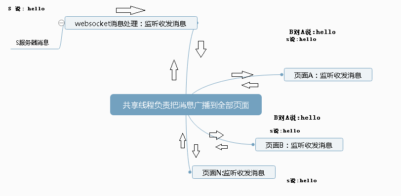

# 说明
#### 什么前端消息子进程分发处理
   &nbsp;假如客服人员在本`web`客服系统查看一个页面的信息并不在接收消息的客服工作台上，如果服器把来访客户消息发送客服工作台上，
   那么这个消息就很可能会被错过。这是因为`http`是无状态的。但本客服系统是采用`http`和`websocket`双协议来开发的再加上`H5`的`SharedWorker`
  线程共享的技术，这样情况是可以避免的。这里我提出了消息分发处理方案。  
  &nbsp;前端消息分发是使用`SharedWorker`共享线程的方式把后端的消息和一个页面的消息和另外多个页面3者之间共享数据。
  
  
  

